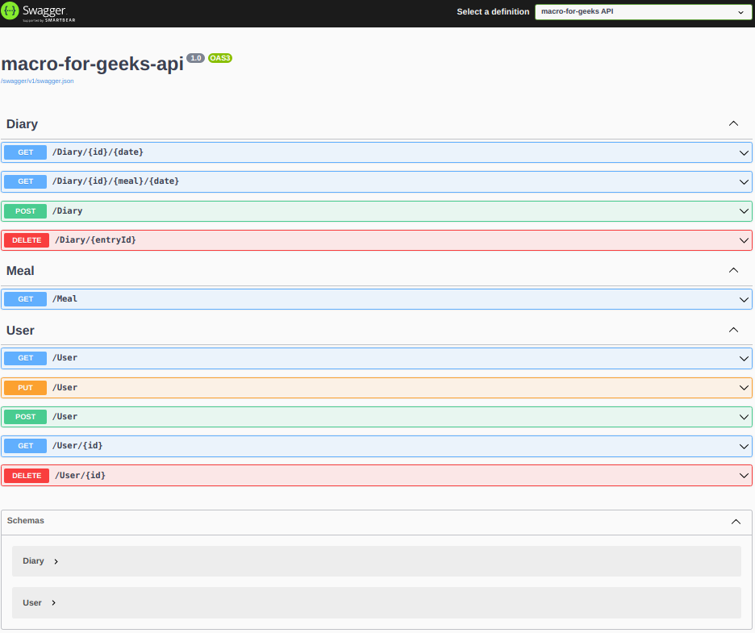

# Macros-for-geeks

This is a full-stack Macro-Counter application to help you keep track of your via your macronutrients. User's can make use of a third-party API from the USDA(https://fdc.nal.usda.gov/) to save nutrition information of food, and then post the data using into our SQLite database via our .Net API. We used Angular for the interface to make it easier to create, read, update, and delete data.

