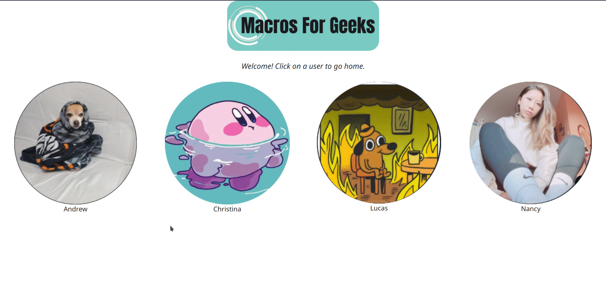

# Macros-for-geeks

This is a fullstack Macro-Counter application using Angular, SQLite, and .Net. User's can make use of a third-party API to look up nutrition information of food, and then post this data using our own API into our SQLite database.
